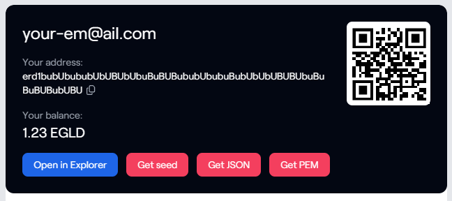

# xAlias Export Key Userscript

## Context

xAlias is one of the login methods on MultiversX, helping novice and non-technical users to create and use a new wallet
by linking it to their Google account.

xAlias provides users with a kind of encrypted backup in the form of a PDF file, and stores authentication data in
Google Drive's hidden storage space dedicated to apps.

Pros:

- Quick and easy creation of a MultiversX wallet address.

Cons:

- Very few services and apps support xAlias as a login provider. In particular, you can't connect to the MultiversX Web
  Wallet, send customized transactions and transfer funds easily.
- There is no explicit way to use the PDF backup to recover a wallet.
- The Google Drive's hidden storage space dedicated to apps isn't easy to access without coding.
- xAlias requires users to give full access to their Google Drive files, with read and write permissions.
- If you loose access to your Google account, you may loose your wallet.
- Overall, there's no way to export your private keys and step up in your experience on MultiversX. "Not your keys, not
  your wallet".

This script goal is to give you back the full control of your xAlias wallet.

## Solution

This userscript helps you export your seed phrase and private key from xAlias. You can then use them with any MultiversX
wallet: xPortal, the browser's extension, the Web Wallet, etc.

It allows you to export your wallet in various formats:

- Seed: a simple text file with your seed/mnemonic words. Be careful how you store it.
- JSON: a keystore protected with a password. With a strong password, you can almost store it as it is.
- PEM: a raw private key, without any protection. Be careful how you store it.

This program works by injecting itself into the xAlias web page, and adding functionalities to it.



## Usage

1. Install
   Tampermonkey ([Chrome](https://chromewebstore.google.com/detail/tampermonkey/dhdgffkkebhmkfjojejmpbldmpobfkfo) / [Firefox](https://addons.mozilla.org/fr/firefox/addon/tampermonkey/))
   or any userscript tool for your browser.
2. Add the script [dist/xalias-export-key.user.js](dist/xalias-export-key.user.js) into Tampermonkey
   or [click here for an automatic installation](https://github.com/BubuMVX/mvx-xalias-export-key/raw/main/dist/xalias-export-key.user.js).
3. Visit https://xalias.com/ and login to get access to the export options.

## Build

For security reasons, this script is fully open source. You can review the code and build it by yourself.

```sh
git clone https://github.com/BubuMVX/mvx-xalias-export-key
cd mvx-xalias-export-key
npm install
```

If you want the source maps to help you work on the code:

```sh
npm run build
```

If you want to build a minified version:

```sh
npm run dist
```

If you get an error related to `fs` in the lib `@multiversx/sdk-bls-wasm`, I didn't find any other solution than
patching this lib once installed:

1. Open `/node_modules/@multiversx/sdk-bls-wasm/bls_c.js`
2. Search for `if(!nodeFS)nodeFS=require("fs");`
3. Comment it

## Credits

This tool exists thanks to the amazing [Userscripter](https://github.com/SimonAlling/userscripter).
